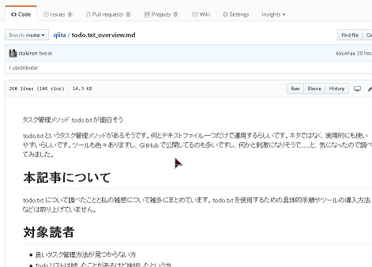
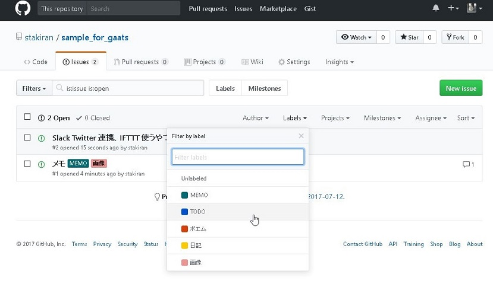

GitHub でテキスト管理を行う **GaaTS(GitHub as a Text Storage)** についてまとめてみました。

※試しに [GitHub でテキスト管理を行う GaaTS(GitHub as a Text Storage) について - Qiita](https://qiita.com/sta/items/e85dc381774acc9ac3c2) を電子書籍化してみたものです。

# GaaTS とは？
GaaTS とは **「GitHub でテキストを管理しようぜ」** という考え方や取り組みのことです。

ここで「テキスト」とはテキストファイル全般を指します。例を挙げるとキリが無いですが、たとえばメモ、記録、日記、ブログや書籍の原稿、小説、あるいは（しっかり管理するまでもない個人的な）コードや設定ファイルなどがあります。

# 対象読者
本記事では以下の知識レベルを想定しています。

- Git や GitHub を使っている、あるいは使っていた
- 「バージョン管理」「UI」「Markdown」といった IT 用語がわかる

GaaTS の用途として以下を想定しています。

- **個人で** テキスト管理を行う
  - 複数人で共同作業する等の用途は想定しません
  - ブログのように不特定多数に見せる用途は想定しません

本記事は以下の方にとって有用だと思われます。

- テキストを管理したいが、良い手段が無くて困っている
- テキストを管理する手法、あるいはテキスト管理というジャンルに興味がある

# メリットとデメリットまとめ
まずはじめに、GaaTS をテキスト管理として使った場合のメリットとデメリットを簡単にまとめておきます。

メリット

- Markdown が使える
- 使い慣れたテキストエディタで書ける
- バージョン管理できる
- 自分のタイミングで同期できる
- ブラウザだけでも下手なサービスより断然使いやすく、見易く、軽い

デメリット

- Git と GitHub の学習コスト
- Git と GitHub を使えるようにするまでの環境整備コスト
- 非公開設定にするために有料プラン + クレジットカードが必要
- ブラウザから見る際のページデザインがストイック、英語、かつ変更不可

以下、詳しく見ていきます。

# GaaTS のメリット
GitHub でテキスト管理と聞くと、「テキストを管理する方法などいくらでもあるだろうに……」「なんでわざわざ GitHub を？」と思うかもしれません。

ここでは GaaTS のメリットを挙げていくことで、わざわざ GitHub を使うことの意味なり意義なりを感じ取ってもらうことを狙います。

## 1: 使い慣れたテキストエディタで書ける
テキストを書く手段としてブラウザがあります。Wiki、チャット、ブログや小説投稿サービス、その他 SNS 等では、ブラウザ上でテキストボックスに文章を書きます。最も身近な手段と言えるでしょう。

このようなブラウザベースのサービスをテキスト管理として利用している場合、テキストの編集はもっぱらブラウザ上で行うことになります。が、この方法は、テキストエディタで編集する場合と比べると、いささか不便です。 **使い慣れたテキストエディタで編集したい** という人もいるでしょう。

GaaTS なら可能です。GaaTS ではローカルでテキストファイルを編集する（＆それを特定のタイミングで GitHub にアップロードする運用になる）ため、お好きなテキストエディタが使えます。

## 2: ブラウザベースとしても優秀
前記と相反しますが、GitHub はブラウザだけでもそこそこ便利にテキストを編集できます。

まず GitHub の UI は、さすが多数のエンジニアに揉まれているだけあって操作性が抜群です。痒いところにも手が届く配慮があって、動作も軽いです。下手に無料ブログを使ったり Wiki を立てたりするよりも無難だと思っています。

また、（詳しくは後述しますが）リポジトリ、Wiki、Gist、Issues など複数の管理手段があり、自分に合った手段を選ぶことができます。これらは単にテキストを編集するではなく、分類・整理、一覧表示や検索など、「管理」を強力に支援する機能を持っており何かと重宝します。

## 3: Markdown で書ける
テキスト管理において問題となるのが **Plain（素のテキスト）だと見辛い** ということです。かといって Word みたくリッチだが重たいエディタで編集するのかと言えば、ノーでしょう。

折衷案として **マークアップ言語** があります。

- 記述はテキスト（と所定の文法）で
- 閲覧時は、エンジンが文法を解釈してそこそこリッチに表示してくれるため見易い

というアイデアです。HTML は有名ですね。近年では多数の Wiki 記法、ブログ記法も登場しています。

このように様々な記法がありますが、私が最も好きなのは **Markdown** です。Markdown は、物覚えの悪い私が唯一馴染めたほどシンプルですし、それでありながら基本的な文法はサポート、さらにメジャーな記法なので対応サービスも多くツールにも不自由しません。

GitHub は Markdown をサポートしています。アップロードしたテキストはレンダリングされ、HTML のように見易い表示で見ることができます。

## 4: バージョン管理できる（編集履歴が残る）
テキストの編集履歴を保持し、後で見返したいというニーズは強く存在します。

普通は「text_1.txt」「text - コピー.txt」のようにファイルを複製して対処しますが、これだとファイルが散乱しますし、いつ、どんな変更を加えたかもわかりづらいです。下手にその辺の注釈を入れようものなら、「text_170713_094622_ドラフト2.txt」なんて大層なファイル名になってしまいます。

このような問題を解決する一つの解が **バージョン管理** です。

バージョン管理技術にも色々あります（SVN、Mercurial、Git など）が、ぶっちゃけテキスト管理するだけなら何でもいいです。どの技術でも履歴は漏れなく管理できます。 **いつ、どこを修正したのかもわかりますし、差分も見れますし、古い履歴を復元できる** のがバージョン管理です。

ただし GitHub を使う以上、Git を使うことになります。幸いにも Git は、他のバージョン管理技術よりも優秀（柔軟に運用できる、ツールやドキュメントが充実している、動作が軽い、内部実装が効率的で無駄がない等）です。後述するように学習コストは辛いのですが、テキスト管理をストレス無しに行えるポテンシャルは十分備わっています。

## 5: 履歴を見易く表示するインタフェースがある
GitHub の魅力の一つが「履歴が見易い」ことでしょう。**ブラウザ上から、見易い UI で、各種履歴や差分を確認できます**。下手なツールよりも断然使いやすく、ソフトウェア開発ではお世話になっているエンジニアさんも多いのではないでしょうか。

いくつか例を挙げます。

以下はコミットログ（履歴）です。いつ、どんな変更がしたかがわかります。

以下は特定コミットにおける差分です。どこをどう変更したのかがわかります。

## 6: 同期を自分のタイミングで行える
※このメリットは特に私の好みが強いです

Dropbox など一般的なクラウドストレージサービスは常に同期を走らせます。これは便利ですが、以下のデメリットがあります。

- プログラムを常駐させる必要がある（リソースを食う）
- 同期するつもりのない一時ファイルも同期される
- 複数のクライアントから同時編集した時に衝突が起きやすい
- **常に同期が走って通信が走るというのが気持ち悪い**

GitHub を使うと、これらを回避できます。

具体的には、アップロードもダウンロードも自分自身のタイミングで行う（git push や git pull コマンドを叩く）ことになります。**いちいち自分でコマンドを叩かないと同期されない** とも言えるので面倒なのですが、私としては常時同期よりは気持ち悪くなく、精神衛生上も好ましいです。

「いちいち git コマンド叩くのが面倒やろ？」とはごもっともですが、そこはツールやコマンドを使ったり、タスク管理ツールで「一日の最後に push 漏れがないか確認せよ！」とリマインドさせるなりして対処しています。私にとって常時同期とは、それだけ気持ち悪いことなのです。

……少し個人の好みを書きすぎちゃいましたが :sweat: 常時同期が嫌いな方がいらっしゃれば、GitHub は良き選択肢になると思います。

# GaaTS のデメリット
ここまで GaaTS のメリットを挙げてきましたが、もちろんデメリットもあります。

総じて言うと **全体的にクセが強い** です。元々エンジニア向けのソースコード管理システムだったものを使っているわけですから、今までのテキスト管理手法やサービス等とはワケが違います。正直申し上げると「早速今日から移行するか」というほど甘くはないです。特にエンジニアでない方であれば、学習は免れないでしょう。

とはいえ、デメリットは工夫次第で軽減できます。以降では各デメリットを挙げるとともに、（可能なら）軽減策についても言及します。

## 1: 学習コスト
GaaTS ではそもそも GitHub を扱うので、Git や GitHub の知識が必要になります。これらは基礎的内容でも一冊の本が出来上がるくらいに濃い世界ですし、エンジニア向けの技術であるゆえに、（エンジニア自身は中々気付かないものですが）多くの前提知識も要求されます。

正直言って学習コストは高いです。新しい Web サービスを気軽に試す、くらいの感覚で使うと面食らいます。

## 2: 環境整備コスト
GitHub を使うためには Git のインストールが必要です。また GitHub と通信を行えるようにするための鍵や認証情報を登録する作業も発生します。慣れればどうということはないのですが、初学者にはハードルが高いです。

## 3: デフォルトでは全て公開設定
GaaTS 最大のデメリットはこれでしょう。

GitHub にアップロードしたテキストは **デフォルトでは Public です**。つまりインターネットに晒されます。他人に見られたらまずいテキストをうっかり公開しちゃうと最悪です。

「すぐ消せばいいじゃないか」と思いがちですが、GitHub はバージョン管理を行うので履歴として残ってしまいます。リポジトリを丸ごと消すか、履歴を書き換えるという荒業をしない限り、消せません。

公開設定を避けるには **Private 設定にする** 必要があります。が、有料プランが必要です。クレジットカードで支払うので、カードを持たない学生さんには厳しいでしょう。

※詳細は後述しますが、裏技として Secret Gist があります。Gist という、GitHub の「単一メモ」に特化した機能があるのですが、ここに無料で使える Private 機能があります。それが Secret Gist です。ただし所詮は URL が Secret（どこにも通知されない＆検索結果にも表示されない） なだけですので、**URL さえわかれば誰でも見ることができます**。管理には注意が必要です。

## 4: 英語
GitHub の世界は基本的に全て英語です。といっても **テキストは日本語でも書けます** ので安心してください。ただ、Github 上の文章やらサポートやらが全て英語だということです。

どことなくハードルの高さを感じますが、最悪ググれば日本語情報もたくさん出てくるので何とかなります。そもそも全体的に直感的かつ簡明につくられているので、思うほど難しくはないです。

## 5: 操作完了までのステップが長い
たとえば GitHub にアップロードしたい場合、git add、git commit、git push と三種類のコマンドが必要です。また、ブランチやリモートの概念が絡むと更に複雑になります。アップロードしたい度に毎回これらを叩くのは煩わしいでしょう。

ここはツールやスクリプトを使って適宜楽をすると便利です。

たとえば私は（Windows の話になりますが） upload.bat という、add/commit/push をまとめて行うバッチファイルを作り、簡単に呼び出せるようにしています。push 先も origin master に固定していますし、場合によってはコミットメッセージさえ固定します。こうすれば upload.bat のダブルクリックだけで push まで完了できます。

「それじゃコミットログが見辛いじゃないか」「後で見返したい時にどうするんだ」と思われるかもしれませんが、個人用のテキスト管理ならこれで何とかなるものです。

## 6: ページデザインにノイズがある
これは GitHub にアップロードしたテキストをブラウザで確認する際に直面する問題なのですが、ページのデザインには（テキスト管理という文脈においては）ノイズがあります。

以下にページの一例を挙げます。

ページ上部に Code だの Issue だの表示されていますが、これらはバージョン管理用のインタフェースであって、単にテキストを見たい場合には正直ジャマです。これも慣れればどうということもないのですが、慣れるまではブラウザ上でテキストを確認する時に違和感がつきまとうと思います。

※ちなみに **GitHub Pages** を使えば任意デザインのウェブサイトを作れますが、html/css/javascript 等でウェブサイトのデータを自製する必要がありハードルは高いでしょう。あと **GitHub Pages は非公開にすることができない** のでそもそも見られたくないテキストを見易く表示させる用途には不向きです。

## 7: 稼働率が少し低い
これは結構シビアな不満なのですが、GitHub（というか github.com ）の稼働率は、実はあまり高くありません。それでも一般的な水準で言うと十分なレベルだとは思いますが……。

そうですね、具体的な数字を挙げるととしたら、動作が重たくなったり、push や pull ができなくなったりといったことがたまにあります。頻度で言えば、一ヶ月に数回以内くらいでしょうか。復旧には数十分から数時間くらいかかる印象です。

毎日当たり前に使っていると、少し通信が途絶えただけでもイラっとしてしまうのが人の性というものではないでしょうか。といっても個人ではどうすることもできません。

強いて言えば、github.com の稼働状況について以下から確認することくらいでしょうか。

- [GitHub System Status](https://status.github.com/)
- [github lang:ja - Twitter検索](https://twitter.com/search?f=tweets&q=github%20lang%3Aja&src=typd)

特に Twitter がオススメです。github.com が重かったり落ちてたりすると途端に関連ツイートが増えるのですぐわかります。「私だけじゃないんだ。みんなに起きてるんだ。なら仕方ないか」と精神的にも少し楽になります。

# テキスト格納先としてどこを使うか
ここまでメリットとデメリットを挙げてきました。

ここからは少し話を変えて、「GitHub のどこにテキストを格納すればいいか」という話をします。

「どこにってどういうこと？」と思われるかもしれませんが、GitHub にはいくつか主要な機能がありまして、どれを用いるかでテキスト管理のやり方がだいぶ変わってくるのです。

格納先として以下があります。

- Repo（リポジトリ）
- Wiki
- Issue
- Gist

以下、各々の詳細を見ていきます。

## Repo（リポジトリ）
汎用的で無難な方法です。とりあえずこれを使っておけば困りはしません。

使い方としては、ローカルに clone したディレクトリ上でテキストなりフォルダなりを追加して、それを push してやると GitHub 側に反映されます。テキストエディタで書きたい場合は基本的にこの方法を使います。

**ファイル数やフォルダ階層に制限はありません**。といってもさすがに何百何千ファイルと配置すると重たくなります。リポジトリは何個も作れるので、適当な単位で分けると良いでしょう。

ちなみにファイルサイズは制限があります。が、何百MB、1GBの世界なのでテキスト管理においては気にすることはないと思います。

それと、重要な **非公開(Private)設定**ですが、有料プランに入れば行えます。非公開にすると他人からは一切見えなくなります。仕事用の機密情報（開発製品のソースコード）を管理する用途でよく使われている機能です。

リポジトリをブラウザから見ると、以下のような画面になります。

ファイル一覧から見たいファイルを選ぶという使い方になります。Find file ボタン（緑色ボタンの横）を押せばファイル名からインクリメンタルサーチができたり、Commits リンク（40 Commitsと書かれたところ）を開けば履歴一覧を見れたり、とかなり便利です。

## Wiki
リポジトリよりも **ブラウザ上で新規・編集しやすい**、**フッタ、サイドバーが表示される（中身も編集可）**、**ページ一覧が右側に表示される** などの特徴があります。

履歴は revisions と書かれた部分をクリックすれば見ることができます。

非公開化についてはリポジトリと同じです（リポジトリを非公開にすれば Wiki も非公開になります。そもそも Wiki はリポジトリにセットでひっついてくる一機能という位置付けです）。

テキストエディタで書けないのは残念ですが、実は出来ないことはないです。**clone すればローカルでも編集できます**。ただしフォルダを作って分類することができません（push はできますがブラウザ上では表示されません）。

## Issue
Issue は本来は報告や議論を行うための機能ですが、ここでテキストを管理することもできます。以下にサンプルのスクショを載せます（画像もアップロードしちゃってますが）。

気軽に書き込むという意味では GitHub の中でダントツで使いやすいです。

また、以下のように Issue の一覧を表示することもできます（サンプルなので2件しか登録してないですが）。

この画面では、指定したラベルのみ表示したり、その他色んなフィルターで絞り込めるので便利です。

ただし Issue は何かとクセが強いので注意が必要です。特に以下が厄介でしょう。

- 一度つくった **Issue は削除できない**
- Clone してローカルで編集できない（Clone できないということは **エクスポート（バックアップ）ができない** ということです）
- Issue の **作成は他人でも行える**
- Issue には Open/Close という **状態** がある

最後に非公開化ですが、Wiki やリポジトリと同じです（リポジトリを非公開にすれば Issue も非公開になります）。

## Gist
Wiki よりも **ブラウザ上で「単一のテキスト」を見易く表示できる** のが特徴です。

**コメントも書ける** ので、ブログっぽく運用することもできます（GitHubアカウント持ってる人しか書き込めませんが）。Qiita の記事みたいなイメージでしょうか。

基本的に1ページ1ファイル用途ですが、clone してローカルで複数ファイルを配置してから push してやると **1ページnファイル** も実現できます。ただし、ブラウザ上では **nファイル全てに対して表示や編集（編集ボックスの表示）が走る**のでページが重たくなります。たとえば 100 件、1000件だったりするとブラウザがフリーズします :sweat: また、フォルダを作ることはできません。

少し上記で触れましたが、 **Secret Gist** というものがあります。Gist を作る際に Public か Secret かを選べるのですが、ここで Secret を選ぶと、作った Gist はどこにも通知されません（≒他人に見られない）。ただ、あくまで通知されないだけですので、 **URL さえわかれば誰にでも見えます**。見られたくないテキストを管理する場合は気をつけましょう。

## まとめ: 各機能の特徴
各機能の特徴を簡単にまとめてみました。

| 項目  | 複数メモ | フォルダ | 非公開化 | ブラウザで編集 | Clone(ローカルで編集) | 一言 |
| ----- | --- | --- | --- | --- | --- | --- |
| Repo  | ○  | ○  | ○  | △  | ○  | 無難 | 
| Wiki  | ○  | △  | ○  | ○  | ○  | Wiki の使い心地がお好きなら | 
| Issue | ○  | ✕  | ○  | ◎  | ✕  | ブラウザからは使いやすいがクセが強い | 
| Gist  | △  | ✕  | △  | ○  | △  | 単一のテキストに焦点を当てたい場合に |

## まとめ: 使い分け
各機能の使い分け方についてまとめてみました。

- 特にこだわりはない
- フォルダを作ってしっかりと分類・整理・管理したい
- ブラウザ上で履歴や差分をよく見る
- :point_right: **リポジトリ**

_

- ブラウザ上での編集がメイン
- Wiki みたいに使いたい
- Wiki に馴染んでいる・Wiki が好き
- :point_right: **Wiki**

_

- ブラウザ上で完結したい
- ラベル張るとか絞り込みするとかそういう整理は簡単に行いたい
- テキストに（Open/Close など）状態をもたせて管理したい
- :point_right: **Issue**

_

- 単一のテキストをブラウザ上で見易く・スッキリと表示させたい
- 単一のテキストに焦点を当てて集中して編集したい
- 非公開のテキストを作りたいけど有料プランはイヤだ
- :point_right: **Gist**

# おわりに
以上、長々と書きましたが、GaaTS についてまとめてみました。何かの参考になれば幸いです。
